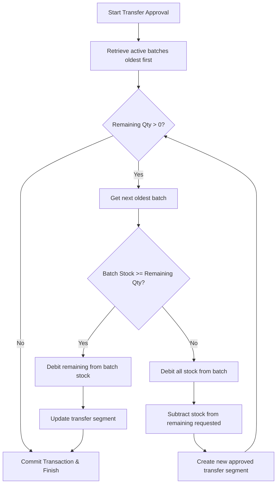

# Loko Harvest - System Architecture & Implementation Documentation

This document serves as a master reference for the architecture, database schema design, core algorithms, data structures, and user flows implemented across the **Loko Harvest** inventory and sales order tracking platform.

---

## 1. Platform Overview

Loko Harvest is a specialized poultry farm management and egg logistics platform. It manages two distinct types of storage locations:
1. **Production Store**: Receives intakes directly from the farm, manages raw egg collections (categorized by quality and size), and batches them with identifiers to coordinate FIFO routing.
2. **Sales Store**: Receives products converted or transferred from the Production Store and manages direct orders, dispatches, drivers, and conversions (e.g. converting egg trays into single eggs or smaller packaging options).

---

## 2. Core Algorithms & Data Structures

### A. FIFO (First In, First Out) Batch Allocation Algorithm
* **Location**: [StoreTransferController.php](file:///d:/lokoorders/loko-harvest-api/app/Http/Controllers/Api/V1/StoreTransferController.php#L125-L210)
* **Problem**: When eggs are transferred from a Production Store to a Sales Store, they must be debited from the oldest active batch first (to prevent egg aging and spoilage). A single requested transfer quantity may span across multiple batches.
* **Algorithm**:
  1. Fetch all active stock items for the requested product in the production store sorted by `created_at ASC` (oldest first).
  2. Maintain a loop to allocate the requested quantity:
     - If the oldest batch has more stock than required, update the batch's quantity, create/update the transfer record for that batch, and terminate.
     - If the oldest batch has less stock than required, deduct all its stock, update the transfer segment, subtract the allocated amount from the remaining requested quantity, and proceed to the next oldest batch.
  3. **Double-Counting Prevention**: To prevent duplicates during a multi-batch split:
     - The first segment updates the original `pending` transfer record to status `approved` and associates it with the first batch.
     - Subsequent segments create **new** pre-approved transfer records associated with their respective batches.
  4. Wrapped inside a **database transaction block** to ensure atomicity (all splits succeed, or none do).



---

### B. HashMap Aggregation (N+1 Query Resolution)
* **Location**: [ProductionStoreStockController.php](file:///d:/lokoorders/loko-harvest-api/app/Http/Controllers/Api/V1/ProductionStoreStockController.php#L23-L121) and [SalesStoreStockController.php](file:///d:/lokoorders/loko-harvest-api/app/Http/Controllers/Api/V1/SalesStoreStockController.php#L23-L181)
* **Problem**: Stock items are batched. Rendering the inventory list required looping through all stock rows and running 10+ individual database queries per row to summarize transaction ledgers. This resulted in an $O(N)$ query scale (e.g., 30 items = 300+ database hits), taking 10-15 seconds per load.
* **Optimization**:
  1. Retrieve all transactions (intakes, transfers, conversions, sales, adjustments, returns) in **bulk** using single queries with `SUM` and `GROUP BY` matching the target store.
  2. Group the resulting collections in-memory using an associative array (HashMap) where the lookup key is a composite string:
     $$\text{Key} = \text{product\_id} + \text{"\_"} + \text{batch\_reference}$$
  3. Map the main stock list and resolve association sums using constant-time lookup:
     $$\text{Time Complexity: } O(1)$$
  4. This reduced the database hit count to a constant **8 queries total**, dropping execution times from 15 seconds to **under 30 milliseconds**.

---

## 3. Database Schema & Approvals Subsystem

### A. Authorization & Approvals Architecture
* **Table**: `store_transfers` (added fields: `status`, `approved_by`, `approved_at`, `rejected_by`, `rejected_at`, `rejection_reason`)
* **Rationale**: The **Order Manager** exclusively works via phone and does not have write-access to modify live inventory balances. 
  - Every transfer action they take writes a `pending` state transfer record.
  - The **Admin** views these requests on their dashboard and either Approves (which triggers the FIFO split and updates stock levels) or Rejects (which keeps stock intact and records the rejection reason).

### B. Stock Calculations & Snapshots
* **Table**: `daily_store_snapshots`
* **Rationale**: Balance rollbacks are performed dynamically by querying approved ledgers relative to the target dates. For historical audits, daily cron tasks compile store snapshots to speed up long-range reports.

---

## 4. User Interface Flows & Mobile Layouts

### A. Mobile-Optimized Dashboard for Order Manager
* **Location**: [order-manager/page.tsx](file:///d:/lokoorders/loko-harvest-app/app/order-manager/page.tsx)
* **Flow**:
  1. **Order Processing Pipeline**: Managers move orders through step-by-step statuses: `pending` $\rightarrow$ `processing` $\rightarrow$ `ready_for_dispatch` $\rightarrow$ `dispatched` $\rightarrow$ `delivered`.
  2. **Driver Assignment**: Assigns drivers to orders and prints routes.
  3. **Inventory Requests**: Displays tabbed inventory views (Sales vs. Production) and contains mobile buttons to request transfers, report damages (with image upload/canvas signature), and record intakes.

### B. Layout Interception for Mobile Forms
* **Location**: [DashboardLayout.tsx](file:///d:/lokoorders/loko-harvest-app/components/layout/DashboardLayout.tsx#L96-L117)
* **Rationale**: When the Order Manager clicks **Record Intake** in their mobile UI, they route to `/production-store/intake`. 
  - To prevent them from seeing the desktop admin sidebar, the layout detects their `order_manager` role and swaps out the desktop layout.
  - It renders a clean **mobile header with a Back button** pointing to `/order-manager`, keeping the flow isolated.

### C. Admin Pending Requests Panel
* **Location**: [pending-requests/page.tsx](file:///d:/lokoorders/loko-harvest-app/app/pending-requests/page.tsx)
* **Flow**:
  - Displays pending Transfers and Damages. Includes magnifier lightboxes for signatures and photo proof, and custom comment triggers for rejections.
  - Linked to a live sidebar badge counter showing active pending counts.

---

## 5. Summary of Recent Changes

| Date & Time | Component | Action / Modification | Rationale |
| :--- | :--- | :--- | :--- |
| 2026-07-08 | **Backend DB** | Migration adding `status` and `approval` tracking onto `store_transfers`. | Support double-authorization workflows for Order Managers. |
| 2026-07-08 | **Stock Controllers** | HashMap-based bulk queries replacing N+1 mapped queries. | Improved performance from 15 seconds to under 30 milliseconds. |
| 2026-07-08 | **UI Layouts** | Created tabbed Admin Approval Panel & Sidebar badge. | Give Admin full control over queued manager requests. |
| 2026-07-08 | **Layout Router** | Role-based interception inside `DashboardLayout`. | Keep Order Manager isolated within a mobile view. |
| 2026-07-08 | **Inventory view** | Added store list check `storeExists` before `loadStock` fetches. | Prevent race conditions when swapping store types. |
| 2026-07-08 | **Inventory view** | Two-part Sales Store daily stock ledger with sub-row pack mappings. | Group Sales Store into Bulk Egg vs. Converted Pack columns side-by-side. |

---

## 6. Detailed Problem & Solution Logs

### 1. Unwanted Desktop Sidebar Leak on Mobile Intakes
* **The Gap/Problem**: The Order Manager dashboard is optimized for mobile views. However, clicking the **Record Intake** button redirected the manager to `/production-store/intake`, which was wrapped in the shared `DashboardLayout`. Consequently, the manager saw the desktop Admin's sidebar navigation (with tabs they shouldn't access) and the Admin's name/profile header (e.g. "Omar Muammar Admin"), creating security leaks and layout breaks.
* **The Implementation & Rationale**: We modified `DashboardLayout.tsx` to detect if the logged-in user is an `order_manager`. If they are, it completely bypasses the desktop sidebar and header rendering. Instead, it serves a simple full-width layout with a mobile header featuring a **Back** button that returns them directly to `/order-manager`. This preserves the account boundaries and keeps the manager’s workflow optimized for mobile viewport dimensions.

### 2. TypeError on Pending Adjustments Tab
* **The Gap/Problem**: When the Admin visited the "Pending Requests" dashboard page and clicked on the "Adjustments/Damages" tab, the application immediately crashed with `TypeError: adjustments.map is not a function`. The backend endpoint `/store-adjustments` returns a paginated Laravel collection object rather than a raw array. The frontend was saving this raw response object directly to the state, causing `.map()` to fail.
* **The Implementation & Rationale**: We fixed the array resolver in both the frontend page and the layout sidebar badge count:
  - Adjusted the setter: `setAdjustments(res.data?.data?.data || res.data?.data || [])`.
  - Adjusted the counter: `const adjustmentsCount = adjustmentsRes.data?.data?.total || ...`.
  This allows the frontend to safely parse and maps over paginated collection data structures seamlessly.

### 3. Inventory Loading Sluggishness & Mismatched Dropdowns
* **The Gap/Problem**: The Order Manager’s Inventory tab was loading extremely slowly (taking 10 to 15 seconds). Additionally, clicking the "Production Store" sub-tab displayed Sales Stores (like "Akright Sales Store") in the dropdown select options instead of Production Stores.
  - *API Performance*: The backend stock controllers were mapping over all stock rows and executing 10+ query calculations for each row (N+1 query bottleneck). This fired hundreds of queries per page load, blocking the browser's request queue.
  - *Race Condition*: When switching tabs, `loadStores` and `loadStock` were triggered concurrently. Because the API was so slow, `loadStock` would make a request to `/production-stock` using the old tab's sales store ID before `loadStores` finished updating the selection.
* **The Implementation & Rationale**:
  - We refactored both `ProductionStoreStockController@index` and `SalesStoreStockController@index` to query transaction totals in bulk using SQL grouping (`SUM` and `GROUP BY`). We loaded them in-memory using an associative array (HashMap) where key lookup is $O(1)$. This reduced query times from 15 seconds to under 30 milliseconds.
  - We added a guard to the frontend `loadStock` effect:
    ```typescript
    const storeExists = storesList.some(s => s.id === selectedStoreId);
    if (!storeExists) return;
    ```
    This prevents the app from firing a stock fetch with mismatched IDs while the store dropdown list is transitioning, completely eliminating the race condition.

### 4. Batched Card Clutter & Missing Historical Lookup on Mobile Inventory
* **The Gap/Problem**: The Order Manager inventory view displayed stock using individual cards for each batch. This cluttered the viewport when there were multiple batches of the same product. There was also no way to query historical records for a specific date (it only showed current balances).
* **The Implementation & Rationale**: We restructured the layout into a unified, horizontally scrollable daily stock ledger table.
  - **Production Store**: Groups stock items in-memory by **Batch Reference** and **Base Product Name** (aggregating White Eggs, Brown Eggs, Cream Eggs, and non-egg items into clean category columns: Good, D1, D2, D3, Shell). The cells render small category badges for non-zero values, preventing table clutter. We also added a Date Selector input that triggers API queries with `date` parameters, and a dedicated **Totals Row** at the bottom of the table that sums all column values (formatted dynamically in trays). This lets managers track detailed daily movements and closing totals on their mobile devices.
  - **Sales Store**: Groups stock items in-memory by category and batch into a **two-part split table** matching the Admin's structure: Bulk Egg Products (Product, Incoming, Opening, Closing) on the left side, and Converted Pack Products (Packs, Incoming, Opening, Current, Outgoing, Returns, Replacements, Closing) on the right side. Sub-rows are mapped cleanly using React rowspans for each batch. Includes a unified **Totals Row** at the bottom separating bulk trays sum from unit pack sums.
